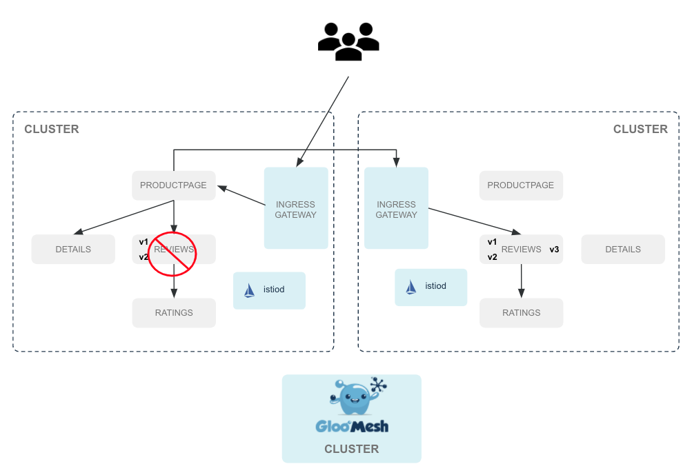

# Gloo Mesh Enterprise Demo

This repository contains definitions for a scripted walkthrough of Gloo Mesh Enterprise features.  The current demo is based on Gloo Mesh 1.2.  Stay tuned for 1.3 features.

## Pre-requisites
This demo assumes that you have a 3-cluster setup and that your kube context names are `mgmt`, `cluster` and `cluster2`.  No other assumptions about your platform are made, but you should have the authority to create external load balancers so that your ingress gateways are accessible.

You should also have Gloo Mesh Enterprise installed on the management plane and Istio 1.11.4 installed on both remote clusters.  For more information on how that's done see our [docs](https://docs.solo.io/gloo-mesh-enterprise/latest/setup/installation/).

Each remote cluster should be [registered](https://docs.solo.io/gloo-mesh-enterprise/latest/setup/enterprise_cluster_registration/) with the management plane.

We also assume that you have the bookinfo application installed on both remote clusters.  We will use the setup below.


## Using Argo

If you want to deploy any of these in a GitOps manner, Argo is supported.  Just remove the `kustomize` subpath.  For example, instead of 

```
kubectl apply -f 01/argo/remote/kustomize/strict-mtls.yaml --context cluster1
```

use

```
kubectl apply -f 01/argo/remote/strict-mtls.yaml --context cluster1
```

This assumes that you have an instance of ArgoCD running on each cluster.

## Demo Steps

### Creating the Virtual Mesh

Enable strict mTLS on both clusters.

```
kubectl apply -f 01/argo/remote/kustomize/strict-mtls.yaml --context cluster1
kubectl apply -f 01/argo/remote/kustomize/strict-mtls.yaml --context cluster2
```

Create the VirtualMesh on the management cluster

```
kubectl apply -f 01/argo/mgmt/kustomize/virtual-mesh.yaml --context mgmt
```

You can then inspect certificates created for Istio by Gloo Mesh.

```
kubectl --context cluster1 exec -t deploy/reviews-v1 -c istio-proxy \
-- openssl s_client -showcerts -connect ratings:9080
kubectl --context cluster2 exec -t deploy/reviews-v1 -c istio-proxy \
-- openssl s_client -showcerts -connect ratings:9080
```

### Access Control

The VirtualMesh provides the facility to enable access control globally.  Here, we will use an overlay to modify the VirtualMesh to set `globalAccessPolicy` to `ENABLED`.

Apply the access control policy.

```
kubectl apply -k 02/mgmt/enable-rbac --context mgmt
```

Refresh bookinfo and you should see `RBAC: access denied`.

Add a policy to allow the ingress gateway to access productpage.

```
kubectl apply -k 02/mgmt/ingress-to-productpage --context mgmt
```

Refresh bookinfo and you should see the page appear again.

Add a policy to allow productpage on cluster1 to talk to details and reviews.

```
kubectl apply -k 02/mgmt/productpage-to-details-reviews --context mgmt
```

Bookinfo should now show everything except for ratings.

Add a policy to allow ratings to be viewed.

```
kubectl apply -k 02/mgmt/reviews-to-ratings --context mgmt
```

Refresh a few times and you should see black stars appear on roughly half the traffic.

### Fault Injection

Create a TrafficPolicy that will cause traffic going from v2 of reviews to ratings to have a 2 second delay.

```
kubectl apply -k 03/mgmt/fixed-delay --context mgmt
```

Now, create a TrafficPolicy that has a timeout policy of .5 seconds when the destination is reviews.

```
kubectl apply -k 03/mgmt/timeout --context mgmt
```

Refresh the browser a few times to see the delay.  Then, delete both traffic policies.

```
kubectl -n gloo-mesh delete trafficpolicy ratings-fault-injection --context mgmt
kubectl -n gloo-mesh delete trafficpolicy reviews-request-timeout --context mgmt
```

### Multicluster Traffic

We will create a TrafficPolicy to shift traffic to the second cluster to see reviews v3.


Create the simple TrafficPolicy.

```
kubectl apply -k 04/mgmt/simple --context mgmt
```

If you see "Ratings service is currently unavailable", then create a new AccessPolicy for reviews.

```
kubectl apply -k 04/mgmt/reviews-access --context mgmt
```

Finally, delete the simple TrafficPolicy

```
kubectl delete trafficpolicy simple -n gloo-mesh --context mgmt
```

### Failover

We want to implement the diagram below.



Create the VirtualDestination to setup global hostname routing.

```
kubectl apply -k 05/mgmt/reviews-global --context mgmt
```

Create a TrafficPolicy that will use the new global hostname.

```
kubectl apply -k 05/mgmt/reviews-shift-failover --context mgmt
```

Put reviews v1 and v2 to sleep on cluster1.

```
kubectl --context ${CLUSTER1} patch deploy reviews-v1 --patch '{"spec": {"template": {"spec": {"containers": [{"name": "reviews","command": ["sleep", "20h"]}]}}}}'
kubectl --context ${CLUSTER1} patch deploy reviews-v2 --patch '{"spec": {"template": {"spec": {"containers": [{"name": "reviews","command": ["sleep", "20h"]}]}}}}'
```

Refresh the browser.  You should start to see failover occur.

Restore service for reviews on cluster1

```
kubectl --context ${CLUSTER1} patch deployment reviews-v1  --type json   -p '[{"op": "remove", "path": "/spec/template/spec/containers/0/command"}]'
kubectl --context ${CLUSTER1} patch deployment reviews-v2  --type json   -p '[{"op": "remove", "path": "/spec/template/spec/containers/0/command"}]'
```
### WASM

Web Assembly (WASM) can be used to add progammability to an Envoy proxy whether that be through the gateway or at the sidecar.

Information about our wasme is at WebAssembly 

You can download the wasme utility from https://github.com/solo-io/wasm/releases.  The following commands assume that you download it to your $HOME/Downloads folder.

```
mkdir -p ~/.wasme/bin
cp ~/Downloads/wasme-<os family>-<cputarget> ~/.wasme/bin/wasme
chmod +x ~/.wasme/bin/wasme
```

Try `wasme -h` to make sure you can execute the binary.  You may need to open Security & Privacy settings to allow this binary to execute on Mac OS.

```
kubectl patch deployment reviews-v1 --context ${REMOTE_CLUSTER} --patch='{"spec":{"template": {"metadata": {"annotations": {"sidecar.istio.io/bootstrapOverride": "gloo-mesh-custom-envoy-bootstrap"}}}}}' --type=merge
```

Bootstrap the remote clusters with the ConfigMap for Envoy.

```
kubectl apply -f wasm/bootstrap/cluster1/kustomize/gloo-mesh-custom-envoy-bootstrap.yaml --context ${CLUSTER1}
```

You can use the wasme utility to create a filter skeleton.

```
wasme init assemblyscript-filter
```

This will create a template for you.  You can see an example in wasm/myfilter.

#### WASM Toolchain

To compile WebAssembly modules without wasme, you will need to use the WASM toolchain.  There is a great Getting Started page on Mozilla's [developer website](https://developer.mozilla.org/en-US/docs/WebAssembly/C_to_wasm#emscripten_environment_setup) that will walk you through create WebAssembly from several different languages.